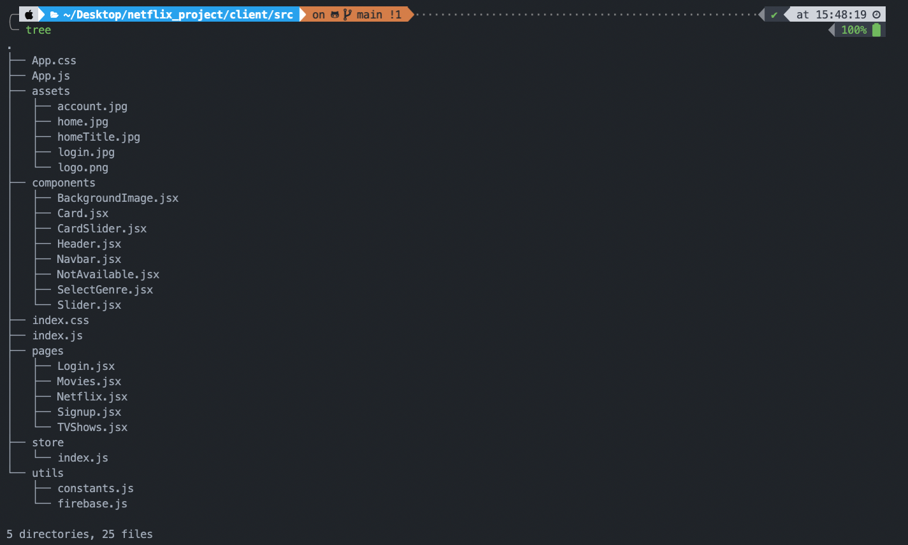

# Netflix_TW Project

## Objective

This app aimed to get know with some frontend knowlege i.e. react, axios, redux, firebase, styled-components.

In the future, I will add the server side like node, db stuff

## Usage

1. Clone this repo
2. Install required packge with `yarn install` or `npm install`
3. You might consider manually add .env file and assets folder and set up firebase setting .
4. After these, run `yarn start` or `npm start` in your local host, you will able to see netflix-like page

## Folders

tree

1. assets/: store with netflix matrial.
2. components/: store with reusable components.
3. pages/: store with different pages, handle the visit logic using react-route-dom.
4. store/: using redux to fetch api data, then dispatch for desired from http://api.themoviedb.org/3. to render Card component
5. utils/: constants.js is for export some constants, while firebase.js is for user auth

## Demo Pictures

login

signup

home

home2

mylist

mylist2

